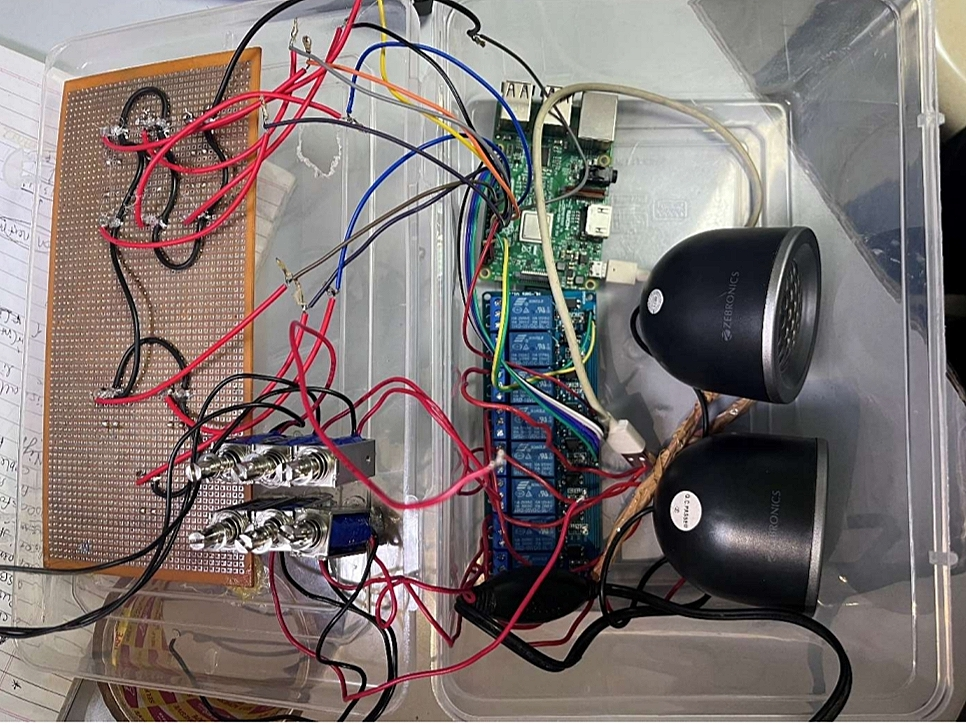

# 🔠 E-Braille – Electronic Braille Converter

**E-Braille** is an electronics-based project that converts English text into **Braille** using hardware components. It helps visually impaired individuals by making text accessible through tactile Braille output. ♿🧑‍🦯

---

## 📸 Project Demo

Here’s how the project setup looks:

  
*Prototype with components: Raspberry Pi, relay module, speakers, switches, and circuit board*

---

## 💡 What It Does

- Accepts English characters as input
- Converts each character into Braille
- Triggers tactile output using relays & pins
- Outputs sound via speakers for audio feedback 🔉

---

## 🛠️ Components Used

- 🤖 **Raspberry Pi**
- ⚡ **Relay Module**
- 🔊 **Speakers** (Zebronics)
- 🎛️ **Switches**
- 🔌 **Wires and Breadboard/PCB**
- 🧠 **Python Code** for processing and control

---

## 🚀 How It Works

1. User enters English text (via software interface or pre-coded)
2. Python code runs on Raspberry Pi to convert it into Braille mapping
3. Relays are activated to move pins representing Braille dots
4. Speaker gives audio confirmation (optional)

---

## 🎯 Objective

To assist the **visually impaired** by creating a low-cost, electronic Braille output device using simple components and programming.

---

## 📂 Project Structure

- `main.py` – Python script for controlling relays and logic
- `IMG_20250308_141411.jpg` – Hardware setup image

---

## 🙌 Acknowledgments

This project was built for educational and accessibility awareness purposes.  
Inspired by the need for **inclusive tech solutions**. 🌍❤️
